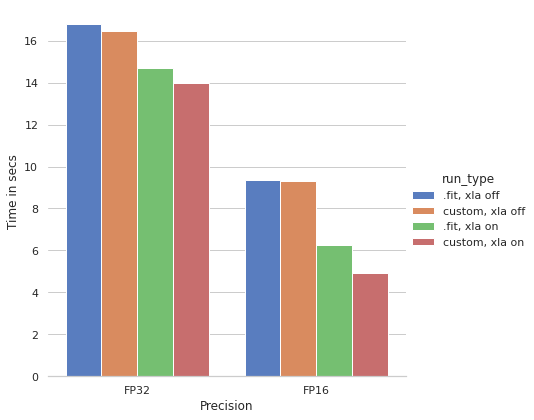

# TF2.x XLA AMP
Training with XLA compilation and Mixed Precision using TF2.x

#### Get 3.4+ times speed up on double the batch size with almost no change in code!

 - Model: ResNet50, `input_shape=(256, 256, 3)`
 - Maximum possible batch sizes on both FP32 and FP16 (128 and 256)
 - 5000 images in each run
 - GPU used:  V100 16GB
 
#### ToDo
- [ ] Distributed Single Worker
- [ ] Distributed Multi Worker
